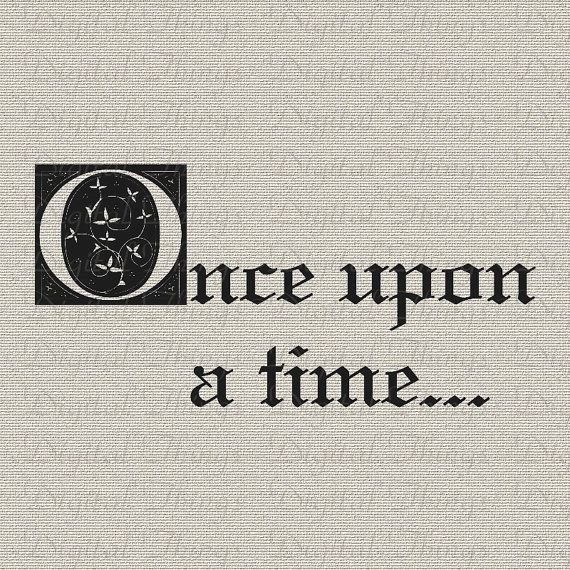

% Literatura infantil digital y SAAC
% Raquel Martín González 
% Mayo 2023

# Introducción

## ¿Por qué este curso?

* Este curso es una forma efectiva de promover la inclusión y la accesibilidad de la literatura, además de ofrecer herramientas del lenguaje SAAC para el desarrollo cognitivo, emocional y social de los niños

\centering

{ width=30% }\ 

## ¿Qué competencias vas a desarrollar?

* Analisis crítico y comparatista acerca de la evolución de los cuentos junto con su aplicación en el mundo digital.
* Introducción a los lenguajes SAAC y ejemplos de como aplicarlos dentro de los cuentos para su enseñanza con transmisión más accesible.

## Contenido

1. Literatura infantil
2. Surge lo digital
3. SAAC
4. Actividades propuestas

# Literatura infantil

## Conceptos 

Se analizan los conceptos de literatura infantil, la cuestión del adjetivo infantil dentro de ciertas narrativas, el cuento y finalmemte el cuento de hadas como sugbenero de este último.

## Origenes

Aunque los origenes de este género son dificiles de trazar, es importante tener presente sus raices orales así como la recepción y recopilación posterior que los ha convertido en un gran cimiento de nuestra cultura.

## Evolución 

Mediante el ejemplo del cuento de Rapunzel, observaremos la variación de temas y adaptaciones que se han ido dando, explorando nuevas narrativas a interes del autor como del contexto en el que la narración se situa.

# Surge lo digital

## La literatura y la tecnología

Se trata la insercción de las nuevas tecnologías dentro del ámbito de la literatura infantil, y como se han visto categorizadas las creaciones surgudas en este nuevo paradigma. Además, se continuará dando ejemplos del cuento de Razpunzel, pero esta vez bajo las nuevas textualidades. 

# SAAC

## ¿Qué es?

Breve explicación de los Sistemas Aumentativos y Alternativos de Comunicación y los recusos más utilizados para su aplicación. 

## Usuarios

Los Sistemas Aumentativos y Alternativos de Comunicación pueden ayudar a cualquier persona que tenga dificultades con el lenguaje debido a diferentes razones o que, simplemente, no entienden el idioma.

## Cuentos

En este apartado veremos como mediante la aplicación de pictogramas podemos construir nuevas narrativas o formas de contar los cuentos que sean accesibles. Con las nuevas tecnologías, su uso se ha visto incrementado y adaptado a múltiples formatos. 

# Actividades

## Guión prácticas 

Se propondrán una serie de actividades para poner en práctica los conceptos vistos a lo largo de este curso.

